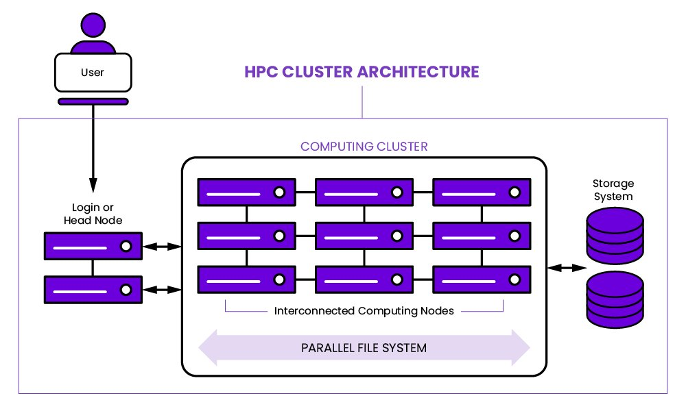
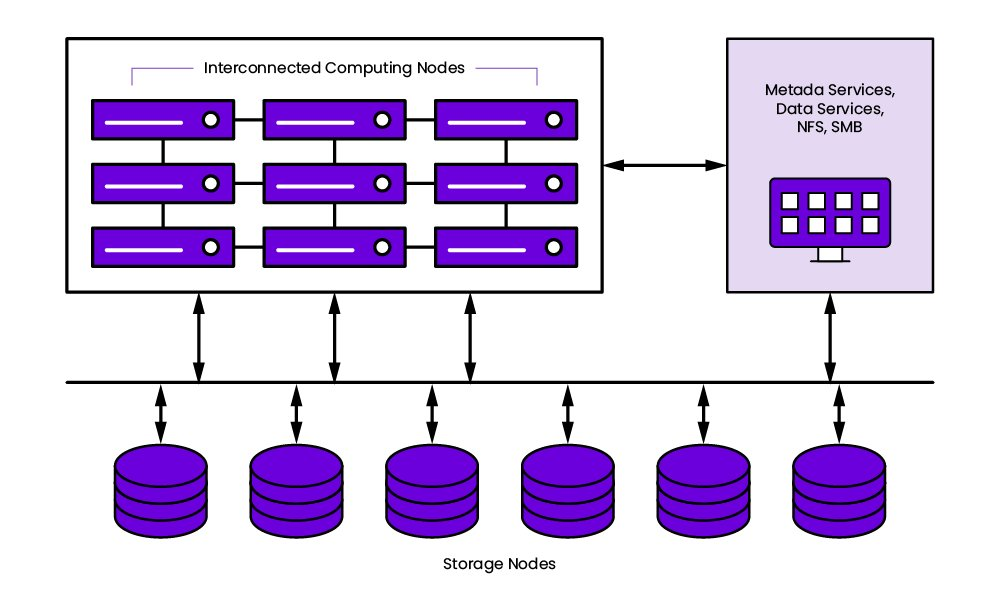

# **Introduction to HPC**

## **What is HPC?**

HPC is technology that uses clusters of powerful processors, working in parallel, to process massive multi-dimensional datasets (big data) and solve complex problems at extremely high speeds. HPC systems typically perform at speeds more than one million times faster than the fastest commodity desktop, laptop or server systems.

For decades the HPC system paradigm was the supercomputer, a purpose-built computer that embodies millions of processors or processor cores. Supercomputers are still with us; at this writing, the fastest supercomputer is the US-based Frontier, with a processing speed of 1.102 *exaflops*, or quintillion floating point operations per second (flops). But today, more and more organizations are running HPC solutions on clusters of high-speed computers servers, hosted on premises or in the cloud.

HPC workloads uncover important new insights that advance human knowledge and create significant competitive advantage. For example, HPC is used to sequence DNA, automate stock trading, and run artificial intelligence (AI) algorithms and simulations—like those enabling self-driving automobiles—that analyze terabytes of data streaming from IoT sensors, radar and GPS systems in real time to make split-second decisions.

The infrastructure of an HPC system contains several subsystems that must scale and function together efficiently: compute, storage, networking, application software, and orchestration.

* **Compute:** The compute portion of an HPC system runs the application, takes the data given to it, and generates an answer. Over the past 20 years, most algorithms have been parallelized, meaning the overall problem is broken up into many parts, with each run on a separate computer or core. Periodically the resulting answers or partial answers must be communicated with the other calculations or stored on a device. Modern servers contain two to four sockets (chips), each with up to 64 cores. Since each core may need to store recently computed information, the demands on the storage device may increase as core counts increase.
* **Storage:** Massive amounts of data are needed to start a long-running simulation or keep it running. Depending on the algorithm, the application may require more data as it runs as well. For example, when simulating the interaction of different drug molecules, thousands of molecular descriptions will have to be ingested at once. As the application runs, more of these descriptions may merit investigation, requiring a low latency and high bandwidth storage infrastructure. In large installations, the amount of online hot storage may be in the Petabyte range. HPC storage is a key component of any smooth and efficiently run high-performance computing cluster.
* **Networking:** Communications between the servers and storage devices should not limit the overall performance of the entire system. Each core that is performing computations may need to communicate with thousands of other cores and request information from other nodes. The network must handle this server-to-server and server-to-storage system communication by design.
* **Application Software:** Software that simulates physical processes and runs across many cores is typically sophisticated. This complexity lies not just in the mathematics underlying the simulation, but also in the reliance on highly tuned libraries to manage the networking, work distribution, and input and output to storage systems. The application must be architected to keep the overall system busy to ensure the high-performing infrastructure offers a high return on investment.
* **Orchestration:** Setting up a part of a large cluster can be challenging. A massive supercomputer will rarely have the entire system dedicated to a single application. Therefore, software is needed to allocate a certain number of servers, GPUs if needed, network bandwidth, and storage capabilities and capacities. All of these sub-systems, as well as the installation of an Operating System (OS) and associated software on the allocated notes, needs to be handled seamlessly and effortlessly. Setting up the software for HPC data storage is critical for applications that require fast data access.

## **How does HPC work?**

A standard computing system solves problems primarily using serial computing—it divides the workload into a sequence of tasks, and then executes the tasks one after the other on the same processor.

In contrast, HPC leverages

* **Massively parallel computing**. Parallel computing runs multiple tasks simultaneously on multiple computer servers or processors. Massively parallel computing is parallel computing using tens of thousands to millions of processors or processor cores.
* **Computer clusters (also called HPC clusters)**. An HPC cluster consists of multiple high-speed computer servers networked together, with a centralized scheduler that manages the parallel computing workload. The computers, called nodes, use either high-performance multi-core CPUs or, more likely today, GPUs (graphical processing units), which are well suited for rigorous mathematical calculations, machine learning models and graphics-intensive tasks. A single HPC cluster can include 100,000 or more nodes.
* **High-performance components:** All the other computing resources in an HPC cluster—networking, memory, storage and file systems—are high-speed, high-throughput and low-latency components that can keep pace with the nodes and optimize the computing power and performance of the cluster.

## **HPC Architecture Explained**

HPC cluster architecture consists of multiple computer servers networked together to form a cluster that offers more performance than a single computer.

**How does HPC architecture differ from traditional computing architecture?**

Although consumer-grade computers can share GPU computing, hardware acceleration, and many of the same techniques that HPC systems do, there are major differences between HPC and traditional computing systems. Especially in areas where HPC is essential to operations, computing and processing power from HPC systems is exponentially higher than traditional computers.

This difference is particularly acute for throughput, scaling speed, and processing. Thus HPC architecture tends to serve as the foundation for the cloud. However, HPC architectures can take various forms—most often cluster, parallel, and grid systems.

Cluster Computing Architecture: A cluster is a set of multiple computers that together operates as a single entity, called a node, to collectively work on the same set of tasks.

Parallel Computing: With a parallel computing configuration, nodes are arranged to execute calculations or commands in parallel similar to GPU processing to scale computation volume and data processing across a system.

Grid Computing: Grid computing systems distribute parts of a more complex problem across multiple nodes.

## **What is an HPC Cluster?**

HPC meaning: An HPC cluster is a collection of components that enable applications to be executed. The software typically runs across many nodes and accesses storage for data reads and writes.

Typically, HPC cluster components include:

* **Head or Login Node:** This node validates users and may set up specific software on the compute nodes.
* **Compute Nodes:** These perform numerical computations. Their persistent storage may be minimal, while the DRAM memory will be high.
* **Accelerator Nodes:** Some nodes may include one or more accelerators, while smaller HPC clusters, purpose built for a specific use may be set up where all nodes contain an accelerator.
* **Storage Nodes or Storage System:** An efficient HPC cluster must contain a high performance, parallel file system (PFS). A PFS allows all nodes to communicate in parallel to the storage drives. HPC storage allows for the compute nodes to operate with minimal wait times.
* **Network Fabric:** In HPC clusters, typically low latency and high bandwidth are required.
* **Software:** HPC cluster computing requires underlying software to execute applications and control underlying infrastructure. Software is essential to the efficient management of the massive amounts of I/O that are inherent to HPC applications.

## **What are the Core/Basic HPC Cluster Components**

High performance computing (HPC) generally processes complex calculations at high speeds in parallel over multiple servers in groups called clusters. Although hundreds or even thousands of compute servers may be linked in an HPC cluster, each component computer is still referred to as a node.

HPC solutions may be deployed in the cloud or on-premises. Flexibility is key. A typical HPC solution has 3 main components:

* Compute
* Network
* Storage

**Compute**

Compute hardware includes a dedicated network with servers and storage and focuses on algorithms, data processing, and problem solving. In general, a minimum of three servers must be provisioned as primary, secondary, and client nodes. more available to the cluster if you virtualize multiple servers.

The networking infrastructure to support the compute power demands high-bandwidth TCP/IP network equipment, such as NICs, Gigabit Ethernet, and switches. Typically, the HPC cluster is managed by the software layer, including tools for monitoring and provisioning file systems and executing cluster functions.

**Network**

Reliable, rapid networking is critical to successful HPC architecture, whether for moving data between computing resources, ingesting external data, or transferring data between storage resources. Physical space is needed to house HPC clusters, and sufficient power is necessary to operate and cool them.

**Storage**

Cloud storage offers high volume and speeds for access and retrieval, making it integral to the success of an HPC system. Traditionally, external storage has been the slowest piece of a computer system, but HPC storage meets the rapid needs of HPC workloads.

### Other Aspects of HPC Architecture

**HPC Schedulers**

An HPC scheduler is specialty software that orchestrates how nodes work on an HPC cluster. An HPC system always has some form of dedicated HPC scheduling software in place.

**GPU-Accelerated Systems**

Although this isn’t an essential component of HPC architecture, accelerated hardware is common, especially in larger systems. GPU acceleration provides parallel processing to support large-scale compute. In turn, these accelerated clusters can support more complex workloads at much faster speeds.

**Data Management Software**

Underlying networking, file, and management system resources must be handled by a specifically optimized software system that directs management operations such as moving data between HPC clusters and long-term cloud storage.

Given these diverse components, it is clear that HPC infrastructure may include on-premise, cloud, or hybrid configurations—depending on the needs of the user. Cloud infrastructure remains, however, a critical component of some of the most demanding industries and workloads.

## **A Glance at HPC Cluster Design**

With these essential elements in mind, let’s move on to HPC Cluster Design and how to build HPC clusters to specifications. We will approach this piece by piece.

### HPC Cluster Configuration Explained

An HPC cluster is many separate computers or servers called nodes collected together and connected via some high-speed means. Different types of nodes may handle different types of tasks.

* As explained above, typical HPC clusters have:
* A login or headnode node
* A data transfer node
* Compute nodes, some with fat compute nodes with a minimum of 1TB of memory
* Graphical Processing Unit (GPU) nodes for computations
* Connecting switch for nodes

And while all cluster nodes share the same memory, CPU cores, and disk space as a laptop or desktop, the difference is in the quality, quantity, and power of the components—and their resulting applications.

## **What is HPC Storage?**

Most HPC storage solutions are file-based with POSIX support. These file-based HPC storage solutions can typically be divided into general purpose and parallel storage solutions.

While some solutions such as Blob (Binary Large Objects) storage or object storage can be used directly by some workloads, not all share that capability.

**General-purpose storage**

General-purpose storage in a HPC cluster is used to store available application binaries with their libraries to maintain consistency while an application runs. It is also used for consistent access to user data such as home directories throughout the HPC cluster.

**Parallel file systems**

A parallel or clustered file system is a shared file system multiple users access at once which serves the storage resources of multiple servers simultaneously. This direct client access to stored data avoids abstraction and eliminates overhead, resulting in high performance and low latency.

* Solutions in this space include:
* WEKA
* Ceph via CephFS
* BeeGFS
* Lustre / DDN Lustre
* DAOS
* GPFS / IBM Spectrum Scale
* VAST Data
* Panasas PanNFS

However, these are not always equally well-suited for artificial intelligence (AI)/machine learning (ML) or similar workloads.

Many parallel file systems such as Lustre and IBM Spectrum Scale (also called GPFS), separate data and metadata into distinct services. This enables HPC clients to communicate directly with storage servers and provides a significant improvement for large file I/O performance.

However, the metadata services become the bottleneck in these scenarios. This is mainly because newer workloads such as those for analytics and IoT are small file (4KB and lower) and metadata intensive.

In a Lustre environment, the MDS size is central to the average file size for storage on the system. The default inode size is 1,024 bytes for the MDT and 512 for the OST. A file system must have at least twice as many inodes on the MDT as it has on the OST or it will run out of inodes, and the file system will be full—even though physical storage media space may be available.

Each time a file is created in Lustre it consumes one inode—regardless of file size. Many AI workloads produce billions of tiny files which consume inodes rapidly. The result is a “full” file system despite physical storage capacity that is only partially used up. For an excellent example of a file system being “full” while only using 30% of the disk space.

Poor metadata performance is an additional challenge. AI and ML workloads require small file access with low latency. The Lustre file system was built for large file access, which manages initial file request latency well.

NASA’s Pleiades Lustre knowledge base best practices include:

* Limiting the files in each directory
* Avoiding “stat” operations
* Placing small files on an NFS mount rather than Lustre where possible
* Placing small files in a dedicated directory so each file needs only one OST
* Avoiding repetitive open and close operations to minimize metadata operations

In other words, it is an ongoing challenge to minimize metadata operations and maintain performance in Lustre for these applications.

In contrast, WEKA is a modern parallel file system that was released in 2017 to address I/O intensive workloads that require massively parallel access and huge metadata performance demands. WEKA was purpose-built to leverage flash-based technology, delivering ultra-low latency and excellent small file performance.

Unlike Lustre and many other parallel systems, which have been optimized for hard disk-based storage and prefer 1MB file size, the WEKA file system strips every file into 4KB chunks and serves them back in parallel. For WEKA, every file problem is a small file problem—and that’s why it manages tiny file performance so effectively.

WEKA has also solved the metadata choke point which too often cripples these systems. The early design of data and metadata separation alleviated many of the legacy NAS issues, but it also created a new bottleneck for modern workloads.

WEKA spreads data and metadata across all nodes in the storage cluster equally, solving the metadata performance issue. Each WEKA node provides metadata services, data services, NFS and SMB access and internal tiering to S3-based object storage for massive scalability.

This greatly simplifies infrastructure while ensuring that performance on small file and metadata is orders of magnitude better than what the Lustre design delivers. And even as the need to add more nodes arises, there is no need to add a complex inode setup in order to scale to the size required by the application.

## **HPC Storage Architecture** **Overview**

Architecting efficient storage capabilities for an HPC cluster can be daunting. There are several critical features that need to be designed into this system, including the simplicity of installing the software needed to satisfy these requirements. It is essential to remove the complexity and tuning from the server orchestration needed for efficient I/O of the data.

To ensure legacy parallel file systems are functional, a significant amount of infrastructure knowledge and systems expertise is required. This involves installing different software on metadata servers (MDS), metadata targets (MDT), object storage servers (OSS), and object server targets (OST). It also includes installing different services on different physical servers—and all of this demands a strong understanding of the overall HPC cluster architecture.

Legacy systems must be modified and updated continuously to access modern storage technologies. Modern servers often contain SSD drives, which offer significant performance advantages for HPC workloads over HDD drives. An HPC workload storage architecture should be able to service computer cluster requests and leverage SSD drive performance.

Additionally, some HPC applications must frequently access “hot” data, while “cold” data can be accessed less frequently. The system will keep the hot data close to the compute nodes on SSDs but may retain cold data in an object storage array.

An HPC architecture also fully distributes data and metadata services to simplify the management process for the overall environment. Metadata services always remain available, regardless of the tier the data rests on. Integrating object storage and NVMe drives into an HPC storage system achieves responses to application requests with higher bandwidth and lower latency.

The benefits of this sort of architecture are that critical, often-used data is stored close to the compute nodes, while less expensive storage devices should be used for less active data. Users can then create policies to automatically move data between the tiers, optimizing for specific data access patterns and use cases. By leveraging a broad range of storage devices, a modern HPC storage system architecture can store exabytes of data while responding with millisecond latencies as needed.

## **Advantages of HPC**

The benefits of HPC assists users in surmounting challenges they face using conventional PCs and processors. HPC benefits include the following:

**High speed**

HPC delivers extremely fast processing, so HPC systems can rapidly perform massive numbers of calculations that regular computing systems would take days, weeks, or months to perform. HPC systems typically improve computing performance and processing speeds with block storage devices, modern CPUs, GPUs, and low-latency networking fabrics.

**Lower costs**

Faster processing and answers from an HPC system typically means saving time and money. And many such systems are in “pay as you go” format as well.

**Reduced physical testing requirements**

Often, modern applications such as self-driving cars demand extensive physical testing before commercial release. Application developers, researchers, and testers can use HPC systems to create powerful simulations, thus minimizing or even eliminating the need for costly physical tests.

## **Disadvantages of HPC**

Despite impressive recent progress in the realm of HPC systems, some barriers to widespread HPC adoption remain:

**Cost –** While cloud infrastructure has made HPC more affordable, it is still an investment— in terms of money and time. And both upfront costs and the costs of managing HPC infrastructure over the long term are part of the equation.

**Compliance –** HPC and data systems upkeep must naturally incorporate any regulations and compliance. For example, an organization that focuses on life sciences developing HPC cloud applications that touch Personal Health Information (PHI) in any way must manage a complex set of compliance standards in the system.

**Security and Governance –** Outside of industry regulations, your organization will adopt data governance policies to help manage data in storage and during its time processed in an HPC environment. Additionally, your data governance will also include whatever security measure you must implement. Cybersecurity applies to all aspects of your high-performance computing environment, from networking to storage and computation.

**Performance –** An HPC environment needs tuning for optimal performance. Given the complexity of computing and cloud systems, there are dozens of tiny inefficiencies that can impact performance significantly.

## **HPC and cloud computing**

As recently as a decade ago, the high cost of HPC—which involved owning or leasing a supercomputer or building and hosting an HPC cluster in an on-premises data center—put HPC out of reach for most organizations.

Today HPC in the cloud—sometimes called HPC as a service, or HPCaaS—offers a significantly faster, more scalable and more affordable way for companies to take advantage of HPC. HPCaaS typically includes access to HPC clusters and infrastructure hosted in a cloud service provider’s data center, plus ecosystem capabilities (such as AI and data analytics) and HPC expertise.

Today HPC in the cloud is driven by three converging trends:

* **Surging demand.** Organizations across all industries are becoming increasingly dependent on the real-time insights and competitive advantage that results from solving the complex problems only HPC apps can solve. For example, credit card fraud detection—something virtually all of us rely on and most of us have experienced at one time or another—relies increasingly on HPC to identify fraud faster and reduce annoying false positives, even as fraud activity expands and fraudsters’ tactics change constantly.
* **Prevalence of lower-latency, higher-throughput RDMA networking.** RDMA—remote direct memory access—enables one networked computer to access another networked computer’s memory without involving either computer’s operating system or interrupting either computer’s processing. This helps minimize latency and maximize throughput. Emerging high-performance RDMA fabrics—including Infiniband, Virtual Interface Architecture, and RDMA over converged ethernet (RoCE)—are essentially making cloud-based HPC possible.
* **Widespread public-cloud and private-cloud HPCaaS availability.** Today every leading public cloud service provider offers HPC services. And while some organizations continue to run highly regulated or sensitive HPC workloads on-premises, many are adopting or migrating to private-cloud HPC solutions offered by hardware and solution vendors.

## **HPC use cases**

HPC applications have become synonymous with AI apps in general, and with machine learning and deep learning apps in particular; today most HPC systems are created with these workloads in mind. These HPC applications are driving continuous innovation in:

**Healthcare, genomics and life sciences.** The first attempt to sequence a human genome took *13 years*; today, HPC systems can do the job in less than a day. Other HPC applications in healthcare and life sciences include drug discovery and design, rapid cancer diagnosis, and molecular modeling.

**Financial services.** In addition to automated trading and fraud detection (noted above), HPC powers applications in Monte Carlo simulation and other risk analysis methods.

**Government and defense.** Two growing HPC use cases in this area are weather forcasting and climate modeling, both of which involve processing vast amounts of historical meteorological data and millions of daily changes in climate-related data points. Other government and defense applications include energy research and intelligence work.

**Energy.** In some cases overlapping with government and defense, energy-related HPC applications include seismic data processing, reservoir simulation and modeling, geospatial analytics, wind simulation and terrain mapping.

