# **Introduction to Linux**

**What is Linux?**

* Free, open-source, and community-developed operating system
* It was created by Linus Torvalds in 1991.
* Released under the GNU General Public License (GPL) version 2.
* Created for computers, servers, mainframes, embedded devices, and mobile devices.
* Can be used in both CLI or GUI mode.
* It supports 32-bit /64-bit hardware.

## **Linux Distribution**

•Also referred to as Distro

•Variations of the Linux operating system

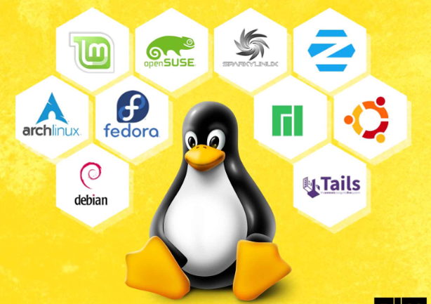

•Example

-Commercially backed distributions - such as Fedora, SUSE, and RHEL

-Community-driven distributions like Debian, Slackware, Gentoo, and

      Arch Linux.

## **Linux Features**

•Multiuser capability

•Multitasking

•Portability

•Security

•File System

## **Advantages Of Linux**

* Open Source
* Security
* Free
* Lightweight
* Stability
* Performance

## **Difference Between Linux and Unix**

|  |  |  |
| --- | --- | --- |
| Comparison | Linux | Unix |
| Definition | It is an open-source operating system which is freely available to everyone. | It is an operating system which can be only used by its copyrighters. |
| Users | Nowadays, Linux is in great demand. Anyone can use Linux whether a home user, developer or a student. | It was developed mainly for servers, workstations and mainframes. |
| Usage | Linux is used everywhere from servers, PC, smartphones, tablets to mainframes and supercomputers. | It is used in servers, workstations and PCs. |
| Examples | It has different distros like Ubuntu, Redhat, Fedora, etc | IBM AIX, HP-UX and Sun Solaris. |

# **Linux Architecture**

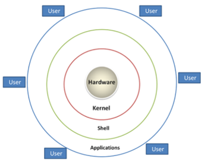

•The Linux OS has primarily three components:

•Kernel: The core component of the Linux operating system.

•Shell: The shell is a command-line interface (CLI) that allows users to interact with the operating system. (e.g- Bash, zsh, csh)

•Application: The userland utilities are a collection of software applications and tools that run on top of the kernel

## **Linux File System**

•A Linux file system is a structured collection of files on a disk drive or a partition.

•Every partition contains a file system.

•The Linux file system contains the following sections:

•The root directory (/)

•A specific data storage format (EXT3, EXT4, BTRFS, XFS and so on)

•A partition or logical volume having a particular file system.

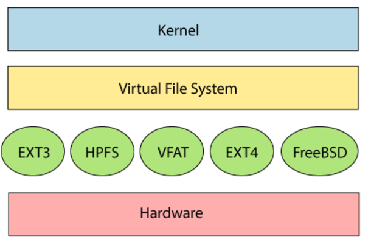

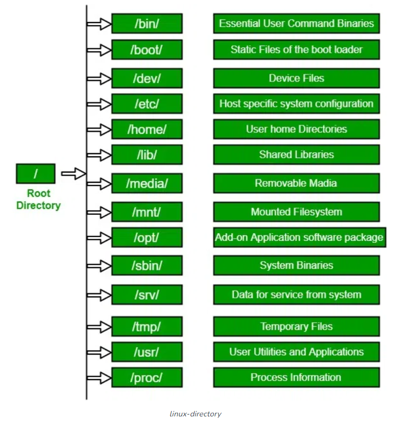

•Root Directory (/):

  - The root directory, denoted by a forward slash (/), is the top-level directory in the file system hierarchy.

•/bin :

  - The "/bin" directory contains various binary executables, which are programs   that can be executed directly by the operating system or users.

•/boot:

  - The "/boot" directory contains configuration files for the system's bootloader,   such as GRUB (Grand Unified Bootloader) or LILO (Linux Loader).

•/var:

  - Files that are unpredictable in size, such as log, cache, and spool files, should   be located in /var.

•/etc:

  - The "/etc" directory contains numerous configuration files that govern the   behavior of various system components, services, and applications.

•/home:

  - Each user account on the system has a corresponding home directory within   the "/home" directory.

•/usr:

  - The "/usr/bin" directory stores executable binaries (programs) primarily used by   regular users.

## **Features of File System**

•Specifying paths - it uses the forward slash (/)

•For example- Windows - C:\ My Documents\ Work

           Linux - /home/ My Document/ Work.

•Partition, Directories, and Drives - Linux does not use drive letters to organize the drive as Windows does.

•Case Sensitivity - Linux file system is case sensitive.

             test.txt      Test.txt

•File Extensions- Not necessary that a file should have a file extension.

•Hidden files- The hidden files in Linux are represented by a dot (.) before the file name (e.g., .ignore).

## **Linux Command Line Interface (CLI)**

•Non-graphical

•Text interface.

TERMINAL

•A terminal is a text input and output environment.

•It is a program that allows you to run a shell.

SHELL

•Shell stands for the command-line interpreter.

•It interprets and processes the commands.

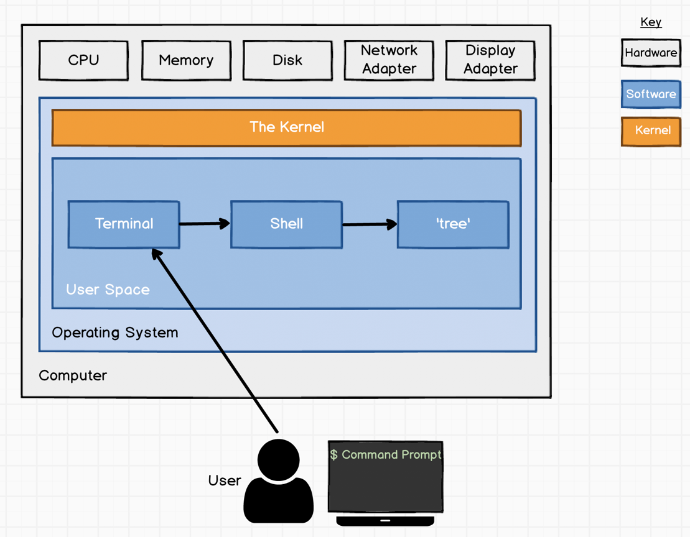

### **Different Types of Shell**

•The Bourne Shell (sh)

•The Bourne-Again Shell (bash)

•The C Shell (csh)

•The Korn Shell (ksh)

•The Z Shell (zsh)

### **Difference Between GUI and CLI**

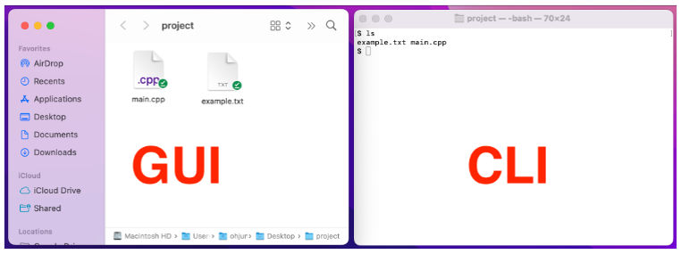

|  |  |
| --- | --- |
| The speed of [GUI](https://www.geeksforgeeks.org/gui-full-form/) is slower than CLI. | CLI is faster than GUI. |
| In GUI, graphics are used. | There are no graphics in CLI. |
| While GUI operating system needs both a mouse and keyboard. | CLI operating system needs only a keyboard. |
| It Consumes more memory. | It consumes low memory. |

### **Advantages of a Command Line Interface**

•Faster and more efficient than any other type of interface.

•It can handle repetitive tasks easily.

•A CLI requires less memory

•Does not use as much CPU processing time.

•A low-resolution monitor can be used.

### **First Look at CLI**

### 

Line 1: The shell prompt, is composed by username@hostname:location$

• Username: our username is called “john”

• Hostname: The name of the system we are logged on

• Location: the working directory we are in

• $: Delimits the end of the prompt

### **Editors**

•Enhancing editing capabilities within the CLI.

•E.g- Vi, Vim, Nano

•Vi Editor

•Oldest and most Widespread text editors

•Improve efficiency and flexibility when working with text files within the CLI.

•Vi offers a powerful set of commands and features that allow for efficient text editing, search and replace, and more.

**VIM Editor**

•Vim, short for "Vi Improved," is an enhanced version of Vi

•Vim builds upon Vi's modal editing approach but incorporates additional conveniences and enhanced capabilities.

•It is highly customizable, offers advanced scripting options, and supports a vast array of plugins, making it a popular choice for developers and power users seeking a versatile text editor within the CLI.

## **Command Syntax**

•  A typical syntax can look similar to this:

                      command [-argument] [--long-argument] file

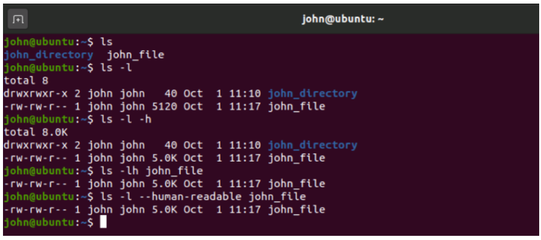

•pwd - prints the current working directory

•PWD - returns an error similar to -bash: PWD: command not found

·The / (forward-slash) is a special character used as a directory separator

·Nearly every Linux command supports --help argument

·The "man" command is used to display the manual pages for various commands, functions, and system calls.

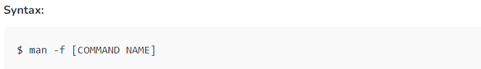

# 

# **Linux Absolute and Relative Paths**

•Relative Paths:

•Relative path is defined as the path related to the present working   directly(pwd)

•It starts at your current directory and never starts with a / .

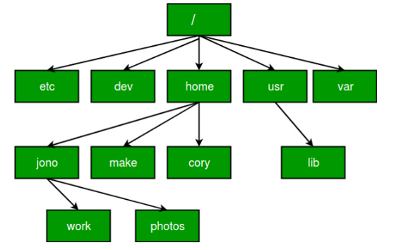

•Absolute path:

  An absolute path is defined as the specifying the location of a file or   directory from the root directory(/).

For Example:-

          $cat abc.sql

          cat  /home/kt/abc.sql

* ### **File**

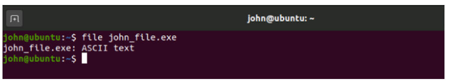

* ### **cat**

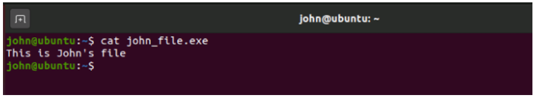

### • cd - changes your working directory to the one passed as argument.

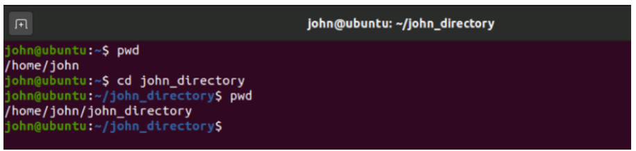

### •cp - used to create a copy of a file or directory.

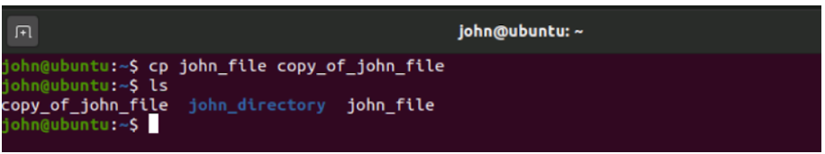

### •mv - moves a file/folder to a new location, or renames it.

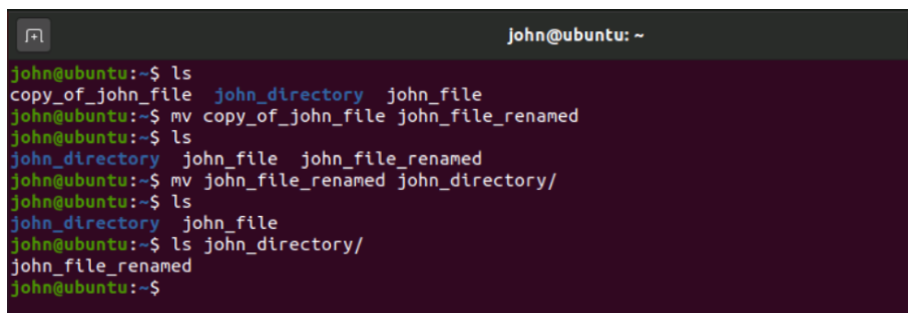

### • rm- the rm command to remove files you no longer need

**rm myfile**

### • mkdir- A directory can be created by using the 'mkdir' command

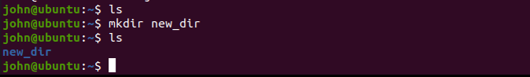

## **Secure Remote communication**

SSH

•SSH (Secure Shell) is a network protocol that provides secure remote communication and command execution.

•Securely access and manage remote servers and systems.

•Execute commands on remote systems without physical presence.

•Syntax  ssh user@host

•user - username on the remote machine

•host – IP address or hostname of the remote machine.

## **File Transfer**

•SCP

•SCP (Secure Copy) is a command-line tool used for secure file transfer between local and remote systems.

•Copy files from local to remote systems securely.

•Retrieve files from remote systems to local machines.

•Syntax - scp source\_file user@destination\_host:destination\_path

•source\_file - is the file to copy,

•user- is the username on the remote machine

•destination\_host - is the address or hostname of the remote machine

•destination\_path - is the location on the remote machine where the file will be copied.

