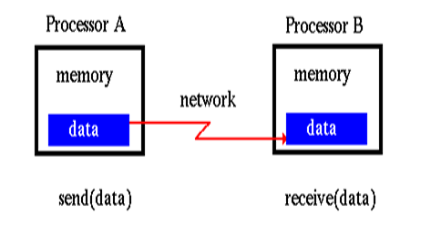
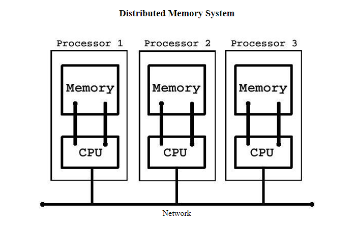
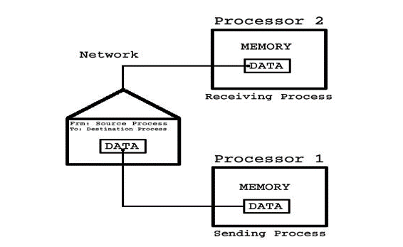
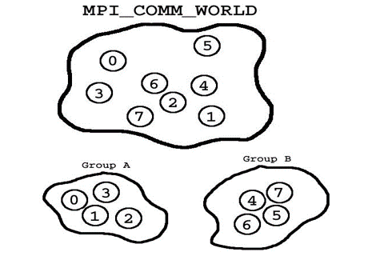
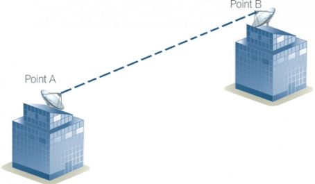
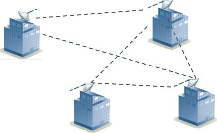
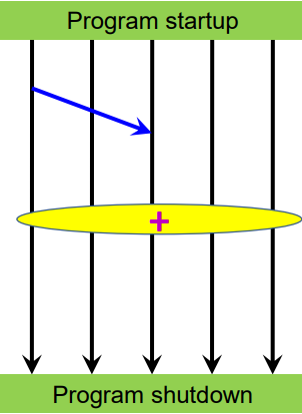

# **Introduction to MPI**

* MPI (Message Passing Interface) is a powerful and widely-used standard for writing parallel and distributed programs
* It provides a rich set of communication primitives for point-to-point and collective communication, allowing processes to exchange data and synchronize their execution
* MPI enables parallel programs to leverage the full potential of distributed computing resources, such as clusters and supercomputers, to solve complex problems efficiently
* By utilizing MPI, developers can design scalable and high-performance applications that take advantage of parallelism and exploit the capabilities of modern computing architectures

## MPI Introduction

A brief history of MPI

* Before the 1990’s, writing parallel applications for different computing architectures was a difficult and tedious task. At that time, many libraries could facilitate building parallel applications, but there was not a standard accepted way of doing it
* During this time, most parallel applications were in the science and research domains. The model most commonly adopted by the libraries was the message passing model
* All it means is that an application passes messages among processes in order to perform a task
* For example - a parallel merge sorting application that sorts data locally on processes and passes results to neighboring processes to merge sorted lists
* Almost any parallel application can be expressed with the message passing model
* Since most libraries at this time used the same message passing model with only minor feature differences among them, the authors of the libraries and others came together at the Supercomputing 1992 conference to define a standard interface for performing message passing - the Message Passing Interface
* This standard interface would allow programmers to write parallel applications that were portable to all major parallel architectures
* It would also allow them to use the features and models they were already used to using in the current popular libraries
* By 1994, a complete interface and standard was defined (MPI-1)
* It was then up to developers to create implementations of the interface for their respective architectures
* After its first implementations were created, MPI was widely adopted and still continues to be the de-facto method of writing message-passing applications

## **Why MPI?**

* The cluster that you will be writing, compiling, and running your MPI programs on is a Distributed Memory System.
* In this system we have a master node, computer, that you log into. Connected to the master node is a network of several other nodes.
* When you run your MPI program on the master node, the master node runs the same program on each one of the nodes in the cluster.
* This way we have access on each node to their processor and memory.

**Basic terms in MPI?**

* Common terms
  + Distributed Memory
  + Process
  + Communicators and Groups
* MPI’s design for the message passing model
* Parallelization

## **Distributed Memory**

**Process**

* A program that runs on a node is called a Process
* When your program is run a process is run on each processor in the cluster. These processes communicate to each other using a system of message passing
* These messages are packets of data that are put into envelopes that contain routing information. Using the message passing system allows us to copy data from the memory of one process to another

**Communicators and Groups**

* A communicator is an object that MPI uses to group collections of process that are allowed to communicate with each other
* All the processes that we have available to us when we begin our MPI program will be ranked and grouped into one single communicator called MPI\_COMM\_WORLD
* MPI\_COMM\_WORLD is the default group when the MPI program is initialized, we can then divide this into separate groups to work with

## **MPI'S Design For The Message Passing Model**

Listed below are some of the classic concepts behind MPI’s design of the message passing model of parallel programming

* The first concept is the notion of a communicator
* In this group of processes, each is assigned a unique rank
* The foundation of communication is built upon send and receive operations among processes

**Point to Point Communication]**

* A process may send a message to another process by providing the rank of the process and a unique tag to identify the message
* The receiver can then post a receive for a message with a given tag
* Communications which involve one sender and receiver are known as point-to-point communications

**Collective Communication**

* There are many cases where processes may need to communicate with everyone else
* MPI can handle a wide variety of these types of collective communications that involve all processes
* Mixtures of point-to-point and collective communications can be used to create highly complex parallel programs

# **MPI Implementation**

## **Parallel execution in MPI**

* Processes run throughout program execution
* MPI startup mechanism: launches tasks/processes establishes communication context (“communicator”)
* MPI Point-to-Point communication:   between pairs of tasks/processes
* MPI Collective communication:    between all processes or a subgroup
* Clean environment by MPI

## **General MPI Program Structure**

## 

## **MPI PPTs**

## **[AICTE-MPI\_PPT](assets/introduction_to_mpi/aicte-mpi_p2p.pdf "MPI")**

## **[MPI\_Collective](assets/introduction_to_mpi/mpi_collective.pdf "MPI_Collective")**

